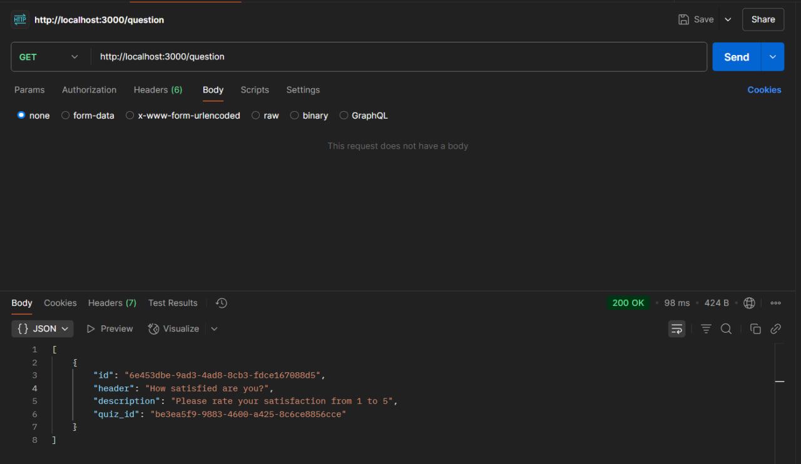
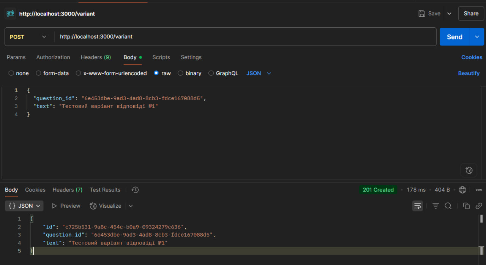
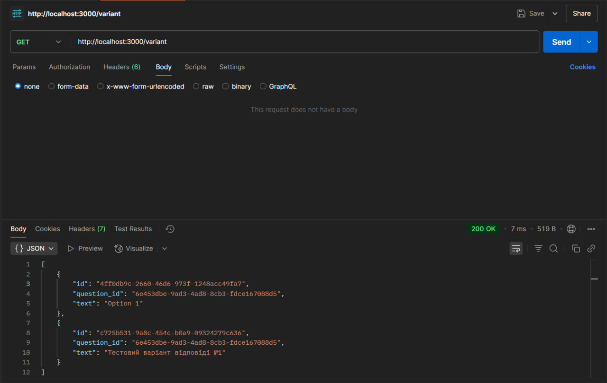
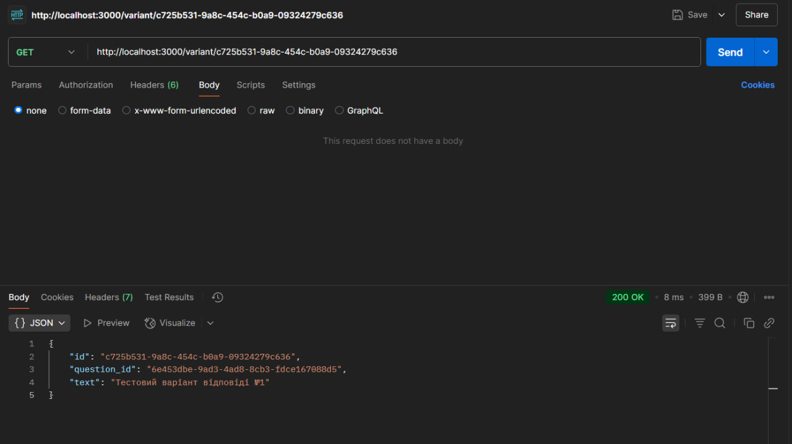
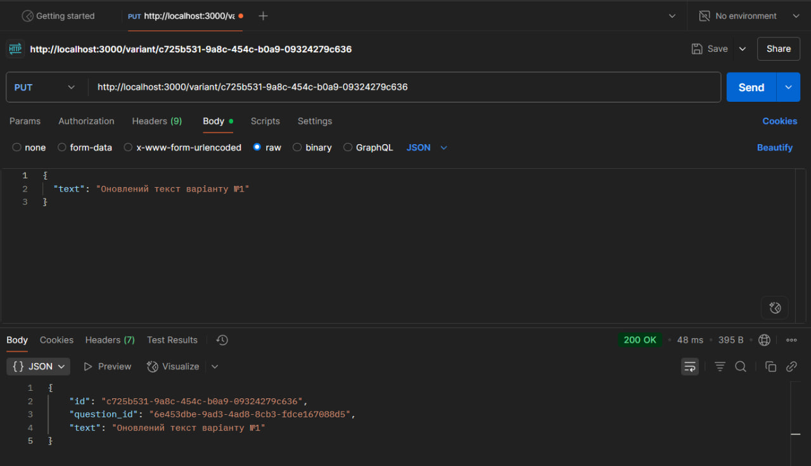
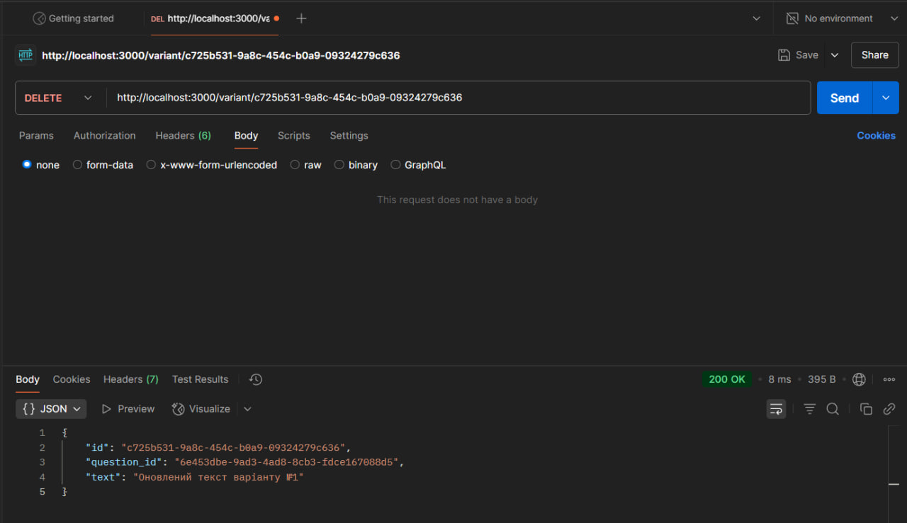
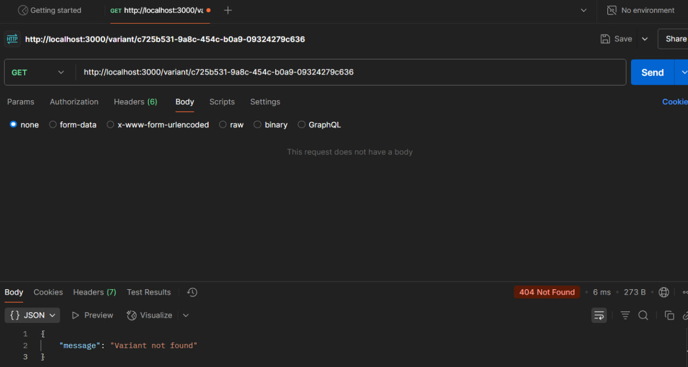

# Тестування працездатності системи

## Передумови

### 1. Встановити залежнсті проекту

```bash
npm install
```

### 2. Запустити сервер

```bash
npm run start:dev
```

## Перевірка працездатности сервісів

### GET: отримаємо всі запитання



### POST: cтворюємо новий Variant для цього питання



### GET: перевіряємо створений Variant



### GET: перевіряємо створений Variant за його id



### PUT: оновлюємо цей Variant



### DELETE: видалити цей Variant



### GET: переконатися що Variant дійсно видалений 

